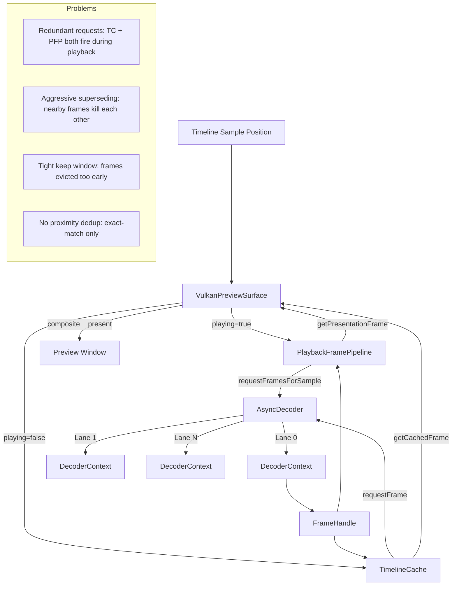

# Playback Preview Glitch Fix Plan

## Problem Summary

The playback preview exhibits visible glitching where frames appear approximate or stale. The debug diagnostics reveal:

1. **High request churn**: `null_callbacks.superseded = 17186`, `null_callbacks.cancel_file = 13315` — most visible decode work is invalidated before completion.
2. **Low exact-hit rate**: Rolling window `exact_hit_rate ≈ 0.32`, `approximate_hit_rate ≈ 0.68` — the preview often falls back to approximate frames.
3. **Aggressive freshness chasing**: The system prefers issuing new requests over waiting for pending ones, causing `queue_full = 0` (decoder is not overloaded) but massive invalidation.
4. **Two parallel request paths**: Both [`TimelineCache`](timeline_cache.h) (via [`requestFrame()`](timeline_cache_requests.cpp:97)) and [`PlaybackFramePipeline`](playback_frame_pipeline.h) (via [`requestFramesForSample()`](playback_frame_pipeline.cpp:306)) independently issue decode requests, creating redundant work.

## Architecture Overview

```
TimelineWidget → VulkanPreviewSurface → TimelineCache (non-playback path)
                                      → PlaybackFramePipeline (playback path)
                                              → AsyncDecoder (multi-lane worker pool)
```

- **Non-playback (stopped) path**: [`VulkanPreviewSurface::refreshFrameStatuses()`](vulkan_preview_surface.cpp) → [`TimelineCache::requestFrame()`](timeline_cache_requests.cpp:97) → [`AsyncDecoder::requestFrame()`](async_decoder.cpp:171)
- **Playback path**: [`VulkanPreviewSurface::refreshFrameStatuses()`](vulkan_preview_surface.cpp:1108) → [`PlaybackFramePipeline::requestFramesForSample()`](playback_frame_pipeline.cpp:306) → [`AsyncDecoder::requestFrame()`](async_decoder.cpp:171)
- Both paths run during playback, creating competing requests for the same frames.

## Root Causes Identified

### 1. Dual-path request duplication
During playback, both [`TimelineCache::requestFrame()`](timeline_cache_requests.cpp:97) (called from [`VulkanPreviewSurface`](vulkan_preview_surface.cpp:1205)) and [`PlaybackFramePipeline::requestFramesForSample()`](playback_frame_pipeline.cpp:306) (called from [`VulkanPreviewSurface`](vulkan_preview_surface.cpp:1108)) issue decode requests for the same clip+frame. The [`PlaybackFramePipeline`](playback_frame_pipeline.h) path is the primary one during playback, but the [`TimelineCache`](timeline_cache.h) path still fires for visible frames, causing redundant requests that get superseded.

### 2. Over-aggressive superseding in AsyncDecoder
[`AsyncDecoder::collectSupersededRequests()`](async_decoder.cpp:799) removes queued visible requests that are more than `kQueuedVisibleSupersedeSlackFrames = 4` frames away from the new request. During fast playback, the playhead moves >4 frames between ticks, so every new visible request kills the previous one before it completes.

### 3. `cancelForFileBefore` throttling too aggressive
[`PlaybackFramePipeline::cancelDecoderBeforeThrottled()`](playback_frame_pipeline.cpp:535) cancels decoder work ahead of the playhead. The `kCancelBeforeMinFrameAdvance = 6` and `kCancelBeforeMinIntervalMs = 45` are reasonable, but the `keepWindow = 8` means frames only 8 frames behind the playhead get cancelled, which is too tight for variable decode latency.

### 4. No coalescing of nearby visible requests
When the playhead moves from frame N to N+1, a new visible request is issued for N+1. The old request for N is superseded. But if N+1 arrives before N completes, the system would be better off keeping the N request and using it as an approximate frame for N+1.

### 5. `evaluatePreviewVisibleRequest` doesn't consider in-flight proximity
[`evaluatePreviewVisibleRequest()`](preview_frame_selection.cpp:36) only checks if the exact frame is cached or if a request is already pending for the *exact same frame*. It doesn't check if a request is pending for a nearby frame that could serve as an approximate.

## Magic Numbers to Make REST-API-Controllable

All of these hardcoded constants need to become runtime-tunable debug controls accessible via `GET /debug` and `POST /debug`:

| Constant | File | Line | Default | Description |
|----------|------|------|---------|-------------|
| `kQueuedVisibleSupersedeSlackFrames` | [`async_decoder.cpp`](async_decoder.cpp) | 36 | 4 | Max frame distance for visible request superseding |
| `kVisibleDecodeKeepWindow` | [`playback_frame_pipeline.cpp`](playback_frame_pipeline.cpp) | 15 | 8 | Frames behind playhead to keep in decoder |
| `kObsoleteVisibleFrameSlack` | [`playback_frame_pipeline.cpp`](playback_frame_pipeline.cpp) | 16 | 2 | Slack for obsolete frame detection |
| `kCancelBeforeMinFrameAdvance` | [`playback_frame_pipeline.cpp`](playback_frame_pipeline.cpp) | 24 | 6 | Min frame advance before cancel is allowed |
| `kCancelBeforeMinIntervalMs` | [`playback_frame_pipeline.cpp`](playback_frame_pipeline.cpp) | 23 | 45 | Min ms between cancel operations |
| `kMaxPresentationPastFrameDelta` | [`playback_frame_pipeline.cpp`](playback_frame_pipeline.cpp) | 21 | 4 | Max frames past playhead for presentation |
| `kMaxPresentationFutureFrameDelta` | [`playback_frame_pipeline.cpp`](playback_frame_pipeline.cpp) | 22 | 4 | Max frames ahead of playhead for presentation |
| `kFileVideoPlaybackWindowAhead` | [`playback_frame_pipeline.cpp`](playback_frame_pipeline.cpp) | 17 | 4 | Lookahead window for file video |
| `kSequenceVisibleDecodeKeepWindow` | [`playback_frame_pipeline.cpp`](playback_frame_pipeline.cpp) | 18 | 32 | Keep window for image sequences |
| `kDefaultMaxVisibleBacklog` | [`vulkan_preview_surface.cpp`](vulkan_preview_surface.cpp) | 40 | 1 | Max visible backlog limit |
| `kVisiblePendingRetryMs` | [`timeline_cache_requests.cpp`](timeline_cache_requests.cpp) | 24 | 2000 | Time before retrying a pending visible request |
| `kObsoleteVisibleFrameSlack` (cache) | [`timeline_cache_requests.cpp`](timeline_cache_requests.cpp) | 23 | 4 | Slack for cache-side obsolete frame detection |

## Proposed Fixes

### Phase 1: Enhance REST API Diagnostics

Add new endpoints and enrich existing ones to provide deeper visibility:

#### 1a. New endpoint: `GET /playback/diagnostics`
Expose the full [`PlaybackFramePipeline::decodeDiagnostics()`](playback_frame_pipeline.cpp:394) and [`AsyncDecoder::diagnosticsSnapshot()`](async_decoder.cpp:911) in a single call, plus the [`playbackSmoothnessSnapshot()`](vulkan_preview_surface_profiling.cpp:571) rolling window data.

#### 1b. New endpoint: `GET /playback/request-trace`
Return a time-series of recent visible request decisions (dispatched, blocked, superseded, completed) with frame numbers and timestamps, so the user can see exactly which frames are being requested and what happens to them.

#### 1c. Enrich `GET /pipeline` with per-clip frame status
Add per-clip breakdown showing: requested frame, presented frame, exact/approximate status, pending request count, and last callback outcome for each active clip.

#### 1d. New endpoint: `GET /playback/tuning`
Return all tunable constants and their current values. Already covered by `GET /debug` once we add them as debug controls.

### Phase 2: Fix Visible Request Churn

#### 2a. Suppress TimelineCache visible requests during playback
In [`VulkanPreviewSurface::refreshFrameStatuses()`](vulkan_preview_surface.cpp), when `m_interaction.playing` is true, skip the [`TimelineCache::requestFrame()`](timeline_cache_requests.cpp:97) path entirely and rely solely on [`PlaybackFramePipeline::requestFramesForSample()`](playback_frame_pipeline.cpp:306). The cache path is redundant during playback.

**File**: [`vulkan_preview_surface.cpp`](vulkan_preview_surface.cpp)
**Location**: Around line 1205, in the `else` branch (non-playback-pipeline path)
**Change**: Add `if (m_interaction.playing) continue;` before the cache request dispatch, since the playback pipeline path already handles frame requests.

#### 2b. Make supersede slack frames a debug control
Replace hardcoded [`kQueuedVisibleSupersedeSlackFrames`](async_decoder.cpp:36) with a call to `debugSupersedeSlackFrames()` from [`debug_controls.h`](debug_controls.h). Default value: 12 (up from 4).

**File**: [`async_decoder.cpp`](async_decoder.cpp), [`debug_controls.h`](debug_controls.h), [`debug_controls.cpp`](debug_controls.cpp)

#### 2c. Make visible decode keep window a debug control
Replace hardcoded [`kVisibleDecodeKeepWindow`](playback_frame_pipeline.cpp:15) with a debug control. Default: 16 (up from 8).

**File**: [`playback_frame_pipeline.cpp`](playback_frame_pipeline.cpp), [`debug_controls.h`](debug_controls.h), [`debug_controls.cpp`](debug_controls.cpp)

#### 2d. Make cancel-before throttle constants debug controls
Replace [`kCancelBeforeMinFrameAdvance`](playback_frame_pipeline.cpp:24) and [`kCancelBeforeMinIntervalMs`](playback_frame_pipeline.cpp:23) with debug controls.

**File**: [`playback_frame_pipeline.cpp`](playback_frame_pipeline.cpp), [`debug_controls.h`](debug_controls.h), [`debug_controls.cpp`](debug_controls.cpp)

#### 2e. Add proximity-based request dedup in evaluatePreviewVisibleRequest
Modify [`evaluatePreviewVisibleRequest()`](preview_frame_selection.cpp:36) to check if a pending request exists for a frame within N frames of the target. If so, skip dispatching a new request since the nearby frame can serve as approximate.

**File**: [`preview_frame_selection.cpp`](preview_frame_selection.cpp), [`preview_frame_selection.h`](preview_frame_selection.h)

### Phase 3: Improve Frame Selection Coalescing

#### 3a. Add frame proximity tolerance to visible request dispatch
In [`PlaybackFramePipeline::schedulePlaybackWindow()`](playback_frame_pipeline.cpp:566), when checking if a frame is already pending (line 607), also check if a pending request exists for a frame within `kObsoleteVisibleFrameSlack` frames. If so, skip the new request.

**File**: [`playback_frame_pipeline.cpp`](playback_frame_pipeline.cpp)
**Location**: Around line 607

#### 3b. Prefer keeping older visible requests over superseding
In [`AsyncDecoder::collectSupersededRequests()`](async_decoder.cpp:799), when a new visible request arrives for a frame within `kQueuedVisibleSupersedeSlackFrames` of an existing queued request, don't supersede the old one — instead, add the new callback to the old request (coalesce).

**File**: [`async_decoder.cpp`](async_decoder.cpp)
**Location**: Around line 811-820

### Phase 4: Adaptive Tuning

#### 4a. Make visible backlog limit adaptive
In [`VulkanPreviewSurface`](vulkan_preview_surface.cpp), dynamically adjust `m_playbackTuning.visibleBacklogLimit` based on the recent exact-hit rate. If the hit rate is low, increase the backlog limit to allow more in-flight requests.

#### 4b. Make all presentation window constants debug controls
Replace [`kMaxPresentationPastFrameDelta`](playback_frame_pipeline.cpp:21), [`kMaxPresentationFutureFrameDelta`](playback_frame_pipeline.cpp:22), [`kFileVideoPlaybackWindowAhead`](playback_frame_pipeline.cpp:17) with debug controls.

### Phase 5: Frame-Level Tracing

#### 5a. Add per-frame trace log
Add a ring buffer in [`PlaybackFramePipeline`](playback_frame_pipeline.h) that records the last N frame request/completion events with: frame number, clip ID, timestamp, outcome (dispatched/completed/superseded/cancelled), and latency.

#### 5b. Expose trace via REST API
Add `GET /playback/frame-trace` that returns the ring buffer contents, filterable by clip ID and frame range.

## Data Flow Diagram



## Implementation Order

1. **Phase 1 (Diagnostics) first** — so we can measure the impact of subsequent changes.
2. **Phase 2 (Churn fix)** — the highest-impact changes: suppress dual-path, increase slack/keep windows.
3. **Phase 3 (Coalescing)** — finer-grained improvements to frame selection.
4. **Phase 4 (Adaptive tuning)** — make the system self-tuning.
5. **Phase 5 (Tracing)** — permanent debugging infrastructure.

## Files to Modify

| File | Changes |
|------|---------|
| [`debug_controls.h`](debug_controls.h) | Add all new debug control declarations (supersede slack, keep window, cancel throttle, presentation window, visible backlog limit, etc.) |
| [`debug_controls.cpp`](debug_controls.cpp) | Implement all new debug control getters/setters with defaults |
| [`vulkan_preview_surface.cpp`](vulkan_preview_surface.cpp) | Suppress TimelineCache path during playback (Phase 2a), adaptive backlog (4a) |
| [`async_decoder.cpp`](async_decoder.cpp) | Use debug control for supersede slack (2b), coalesce nearby requests (3b) |
| [`playback_frame_pipeline.cpp`](playback_frame_pipeline.cpp) | Use debug controls for keep window, cancel throttle, presentation window (2c, 2d, 4b), proximity dedup (3a) |
| [`preview_frame_selection.cpp`](preview_frame_selection.cpp) | Add proximity check to visible request evaluation (2e) |
| [`preview_frame_selection.h`](preview_frame_selection.h) | Add `pendingNearby` field to input struct (2e) |
| [`timeline_cache_requests.cpp`](timeline_cache_requests.cpp) | Use debug control for obsolete slack and retry ms |
| [`control_server_worker_routes.cpp`](control_server_worker_routes.cpp) | Add new diagnostic endpoints (Phase 1) |
| [`vulkan_preview_surface_profiling.cpp`](vulkan_preview_surface_profiling.cpp) | Add per-clip frame status, request trace (1c, 5b) |
| [`playback_frame_pipeline.h`](playback_frame_pipeline.h) | Add trace ring buffer (5a) |
| [`playback_frame_pipeline.cpp`](playback_frame_pipeline.cpp) | Implement trace recording (5a) |
