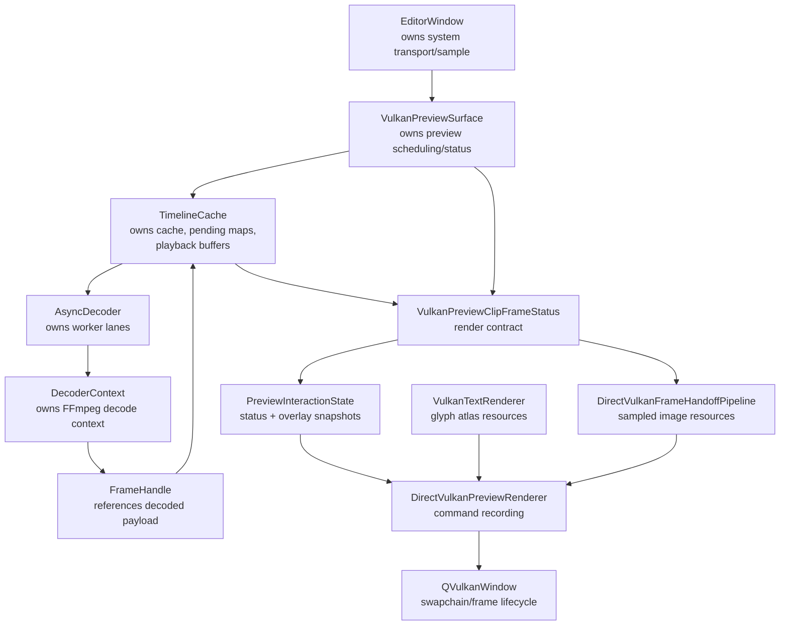
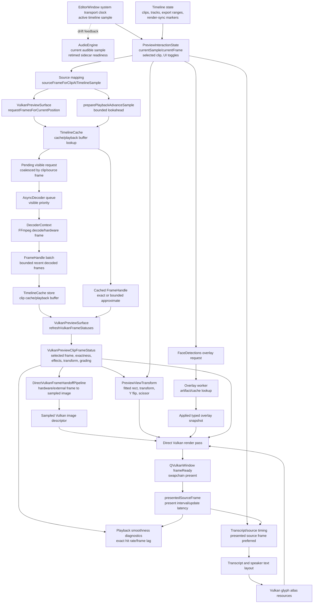

# Synchronization

> **Doc status (2026-06-11):** This document specifies the **target professional architecture**.
> Statements are the contract the implementation must satisfy. Known deviations in the present
> implementation are marked inline as **Present state:** callouts. A code/doc disagreement with
> no callout is a defect — fix the code or update this document, never ignore it.

## Purpose

This document describes the synchronization path from decoded media frames to the direct Vulkan preview render. It complements `TIME.md` and `scheduling.md`:

- `TIME.md` defines temporal domains and conversion truth.
- `scheduling.md` defines which work is scheduled, blocked, dropped, or prioritized.
- This file defines the data, thread, GPU, and render dependencies that must be satisfied before a frame is visible in the preview.

The scope here is the interactive preview path, especially the direct Vulkan presenter. Offline export has similar timing requirements, but it has a different render target and encode tail.

## Core Contract

The preview render is a consumer of one authoritative timeline sample. It does not own time.

At any visible update:

1. `EditorWindow` owns the playback clock and updates the active timeline sample.
2. `PreviewSurface` maps that sample into media source-frame requests.
3. `TimelineCache` and `AsyncDecoder` provide a usable `FrameHandle`.
4. `VulkanPreviewSurface` selects the exact or nearest valid frame and builds `VulkanPreviewClipFrameStatus`.
5. `DirectVulkanPreviewPresenter` renders the selected status list into the swapchain.

The direct Vulkan path must not silently fall back to OpenGL or CPU image upload. CPU readback is diagnostic-only and opt-in.

The target architecture is Vulkan-only (decision D4). The OpenGL preview backend is present-state compatibility scheduled for removal once the parity gates in `OPENGL_DEPRECATION_AND_REMOVAL_PLAN.md` pass; it is not a permanent fallback or alternate backend.

## Professional Synchronization Requirements

A synchronization change is complete only when it names all of these items:

- Temporal source of truth.
- Owning thread for each mutation.
- Data object crossing each boundary.
- Queue, lock, or GPU primitive used at each boundary.
- Lifetime owner of every frame, descriptor, atlas, overlay snapshot, and command-buffer resource.
- Failure behavior when a dependency is missing or late.
- Diagnostic field proving the behavior in a running instance.
- Regression test or CI check covering the invariant.

Any change that only "makes playback look better" without updating these facts is incomplete.

## Decode-To-Preview Steps

### 1. Clock And Playhead Update

Owner: `EditorWindow`

Inputs:

- System monotonic transport time from `EditorWindow::advanceFrame()`.
- Audio feedback sample from `AudioEngine::currentSample()` for latency/drift diagnostics only.
- Playback speed, export ranges, speech filter ranges, and render-sync markers.

Outputs:

- Active timeline sample derived from system transport time.
- Preview-facing timeline sample via `PreviewSurface::setCurrentPlaybackSample(...)`

Synchronization rule:

- All downstream render work derives from the active timeline sample. No preview subsystem advances an independent video clock.

### 2. Source Mapping

Owner: `VulkanPreviewSurface`

Code:

- `VulkanPreviewSurface::setCurrentPlaybackSample(...)`
- `VulkanPreviewSurface::sourceFrameForSample(...)`
- `sourceFrameForClipAtTimelineSample(...)`

Inputs:

- Timeline sample
- Clip trim and playback rate
- Source FPS
- Render-sync markers

Outputs:

- Requested media source frame per active video clip

Synchronization rule:

- Decode request targets are source-frame domain values. Request priority may be derived from timeline distance, but the decode target itself is not a timeline frame.

### 3. Visible Frame Request

Owner: `VulkanPreviewSurface`

Code:

- `VulkanPreviewSurface::requestFramesForCurrentPosition()`
- `VulkanPreviewSurface::preparePlaybackAdvanceSample(...)`

Inputs:

- Requested source frame
- Direct Vulkan payload requirement
- Visible backlog and lookahead settings

Outputs:

- Current visible request through `TimelineCache::requestFrame(...)`
- Bounded near-future visible requests

Synchronization rule:

- Current visible requests can dispatch even when the visible backlog is full.
- Direct Vulkan requests require hardware/GPU payloads.
- Request completion queues a frame-status refresh on the preview owner thread.

### 4. Cache And Pending Request Coalescing

Owner: `TimelineCache`

Code:

- `TimelineCache::requestFrame(...)`
- `TimelineCache::hasDisplayableFrameForPreview(...)`
- `TimelineCache::pendingVisibleRequestCount()`

Inputs:

- Clip id
- Source-frame request
- Hardware/GPU payload requirement
- Playback state

Outputs:

- Immediate cached `FrameHandle`, or queued decode request
- Pending visible request diagnostics

Synchronization rule:

- Exact cached frames are preferred.
- Approximate frames may be used only when allowed by the seek-resync gate and bounded staleness checks.
- Future frames must not be returned by `getLatestAtOrBefore(...)`.
- Late but usable hardware frames are still cached, because they can help near-current presentation.

### 5. Decode Scheduling

Owner: `AsyncDecoder`

Code:

- `AsyncDecoder::requestFrame(...)`
- `AsyncDecoder::runLane(...)`
- `DecoderContext::decodeThroughFrame(...)`

Inputs:

- Source-frame request
- Request kind: visible, prefetch, preload
- Priority
- Deadline

Outputs:

- `FrameHandle`
- For sequential video decode, a bounded batch of recently decoded frames can be published so lookahead cache is populated by work already performed.

Synchronization rule:

- Visible requests outrank prefetch.
- Visible requests for the same file are not superseded by other visible requests merely because playback advanced.
- Sequential decode may publish a batch of recently decoded frames, but a visible request is complete only when the exact requested source frame is present. Returning an older batch frame as the visible request result hides starvation and produces black/stale presentation failures.
- Decode callbacks are delivered back through Qt queued invocation before cache mutation visible to UI consumers.

### 6. Frame Residency And Payload Validation

Owner: `TimelineCache`

Inputs:

- Decoder callback `FrameHandle`
- Direct Vulkan payload requirement

Outputs:

- Clip cache entry
- Playback buffer entry
- `frameLoaded(...)` signal
- Visible decode diagnostics

Synchronization rule:

- Direct Vulkan preview rejects CPU-only payloads for visible video.
- Hardware frames and external GPU frames are valid preview payloads.
- Memory residency policy may evict old frames, but must not evict the current visible window before presentation can consume it.

### 7. Frame Status Refresh

Owner: `VulkanPreviewSurface`

Code:

- `VulkanPreviewSurface::refreshVulkanFrameStatuses()`
- `selectPreviewFrame(...)`
- `evaluateEffectiveVisualEffectsAtPosition(...)`
- `evaluateClipRenderTransformAtPosition(...)`

Inputs:

- Active timeline sample
- Active clip list
- Cache/playback buffer
- Effects, grading, opacity, masks, transform, speaker framing state

Outputs:

- `PreviewInteractionState::vulkanFrameStatuses`
- Per-clip `VulkanPreviewClipFrameStatus`
- Smoothness samples: exact/approx/missing counts, frame lag

Synchronization rule:

- `VulkanPreviewClipFrameStatus` is the render contract between scheduling/cache and the Vulkan presenter.
- Status refresh must stay cheap enough for playback. It must not perform heavy artifact parsing or CPU image materialization.
- During playback, frame status refresh is queued/coalesced where possible instead of recursively refreshed from multiple paths.

### 8. Overlay Snapshot Preparation

Owner: `VulkanPreviewSurface` plus overlay worker

Code:

- `VulkanPreviewSurface::refreshFacestreamOverlays()`
- `requestFacestreamOverlaySnapshotAsync(...)`
- `applyFacestreamOverlaySnapshot(...)`

Inputs:

- Requested/presented source frame
- Active clip id
- FaceDetections artifact cache
- Overlay source filter
- Hover/assignment state

Outputs:

- Typed facestream overlay lists in `PreviewInteractionState`
- Raw detection overlay lists

Synchronization rule:

- Overlay preparation is not a playback clock and must not block visible video.
- Worker results are keyed and stale results are dropped.
- The render thread consumes only the currently applied typed overlay snapshot.
- FaceDetections/speaker-track boxes are an explicit diagnostic/assignment overlay and must default off. When enabled, playback preparation must use source-frame indexed candidates and then validate them through the normal time-domain resolver; it must not scan every cached track on every preview tick.

### 9. Text Layout And Atlas Preparation

Owner: direct Vulkan renderer text path

Code:

- `VulkanTextRenderer`
- `currentSpeakerLabelForState(...)`
- `prepareTranscriptOverlayAtlas(...)`
- `prepareSpeakerLabelAtlas(...)`

Inputs:

- Presented source frame when available for subtitle timing
- Transcript overlay layout
- Speaker label spec
- Output size and composite rect

Outputs:

- Vulkan glyph atlas resources
- Prepared transcript and speaker label draw commands

Synchronization rule:

- Text is rendered through Vulkan glyph-atlas passes.
- Qt/QPainter whole-label CPU rendering is not part of the direct Vulkan preview path.
- Live subtitles should prefer timing derived from the presented media source frame when a presented frame exists, so text does not lead late video.
- Transcript/speaker discovery is metadata preparation, not presentation. It must be cached or bounded before command recording can depend on it.
- Current-speaker labels must reuse the active transcript word/section range while the playhead remains inside that range. A rendered frame must not linearly rescan the whole transcript just to rediscover the same speaker name or organization.
- Playback diagnostics may report the last/current speaker label, but verbose candidate-debug expansion is suppressed while playback is active unless an explicit heavy diagnostic path is requested.

### 10. GPU Handoff

Owner: `DirectVulkanPreviewRenderer`

Code:

- `DirectVulkanFrameHandoffPipeline`
- `DirectVulkanPreviewRenderer::render(...)`

Inputs:

- `FrameHandle` from `VulkanPreviewClipFrameStatus`
- Vulkan device resources
- Hardware frame or external Vulkan frame

Outputs:

- Sampled Vulkan image/descriptor usable by the preview graphics pipeline
- Handoff diagnostics: mode, probe path, upload time, errors, success/failure counters

Synchronization rule:

- Hardware frames must be synchronized into Vulkan-visible sampled images before drawing.
- Handoff failure must be explicit in diagnostics.
- CPU image upload is not an implicit fallback for normal direct Vulkan preview.

### 11. Vulkan Command Recording

Owner: `DirectVulkanPreviewRenderer`

Inputs:

- Swapchain image
- Prepared frame handoff results
- Per-clip geometry
- Effects/grading uniforms
- Text atlas resources
- Overlay primitives

Render order:

1. Begin frame and acquire swapchain target.
2. Prepare playback-status overlay texture, transcript atlas, and speaker-label atlas.
3. Begin render pass.
4. Render audio view if the preview is in audio mode; otherwise continue video composition.
5. Clear output canvas and border.
6. For each active video clip:
   - Compute fitted clip rect from output size and source/frame dimensions.
   - Apply clip transform and transient interaction override.
   - Apply Y flip when required by sampled payload orientation.
   - Bind sampled frame descriptor.
   - Draw clip through the Vulkan pipeline with grading/effects push constants.
   - Draw transcript overlay for that clip.
   - Draw selection outline if selected.
7. Draw current speaker label.
8. Draw playback-status overlay.
9. Draw FaceDetections and raw detection boxes from applied overlay snapshot.
10. Draw speaker framing target box when enabled.
11. End render pass.
12. Mark presented source frame.
13. Notify `QVulkanWindow` frame readiness.
14. Schedule the next preview update if playback is active.

Synchronization rule:

- At frame start, the renderer latches `PreviewInteractionState` into a local render snapshot. Command recording consumes that snapshot, not the mutable live state pointer.
- The presented source frame recorded after drawing is the visual truth for presentation diagnostics and subtitle timing on the next cycle.

### 12. Presentation

Owner: `DirectVulkanPreviewPresenter` / `QVulkanWindow`

Inputs:

- Submitted command buffer
- Swapchain state

Outputs:

- Visible preview frame
- Present interval and preview update latency diagnostics

Synchronization rule:

- Device loss is terminal for the direct presenter until the Vulkan path is reinitialized.
- There is no implicit OpenGL fallback. Per D4 the target is Vulkan-only; the OpenGL preview backend exists only as present-state compatibility scheduled for removal (`OPENGL_DEPRECATION_AND_REMOVAL_PLAN.md`).

## Frame Lifecycle State Machine

The visible preview frame lifecycle is:

```text
unrequested
  -> requested_current | requested_lookahead
  -> pending_visible
  -> decoding
  -> decoded
  -> cached
  -> selected_exact | selected_approximate
  -> handoff_pending
  -> sampled_image_ready
  -> command_recorded
  -> submitted
  -> presented
```

State definitions:

| State | Owner | Entry Condition | Exit Condition | Diagnostics |
| --- | --- | --- | --- | --- |
| `unrequested` | `VulkanPreviewSurface` | Active sample maps to source frame but no request exists | Visible request dispatched or cache hit found | `last_visible_request_decision` |
| `requested_current` | `VulkanPreviewSurface` | Current source frame is missing or stale | `TimelineCache::requestFrame(...)` accepts or deduplicates | `last_visible_request_frame` |
| `requested_lookahead` | `VulkanPreviewSurface` | Future sample in bounded lookahead is missing | Cache accepts prefetch/current-visible request | `vulkan_effective_lookahead_frames` |
| `pending_visible` | `TimelineCache` | Request key exists in pending visible map | Decoder callback drains callbacks | `pending_visible_requests` |
| `decoding` | `AsyncDecoder` | Worker lane pops request | `DecoderContext` returns frame/batch/null | `decoder_diagnostics.decode_timing` |
| `decoded` | `DecoderContext` | FFmpeg produced a valid frame | Callback delivered to cache | `last_payload` |
| `cached` | `TimelineCache` | Frame inserted into clip cache/playback buffer | Selected or evicted by residency policy | cache frame counts/memory pressure |
| `selected_exact` | `VulkanPreviewSurface` | Selected frame number equals requested source frame | Handoff begins | `active_frame_selection=exact` |
| `selected_approximate` | `VulkanPreviewSurface` | Bounded prior frame selected | Handoff begins or exact arrives | `frame_lag`, `exact_hit_rate` |
| `handoff_pending` | `DirectVulkanFrameHandoffPipeline` | Frame selected for draw | Sampled image ready or handoff error | `last_handoff_mode` |
| `sampled_image_ready` | `DirectVulkanFrameHandoffPipeline` | Descriptor references sampled image | Render pass binds descriptor | `sampled_image_ready_count` |
| `command_recorded` | `DirectVulkanPreviewRenderer` | Render pass commands recorded | Submit/present | texture draw counters |
| `submitted` | `QVulkanWindow` / Vulkan | Command buffer submitted | Swapchain present completes | present interval |
| `presented` | `DirectVulkanPreviewPresenter` | Frame visible or frame-ready signaled | Next update cycle | `presented_source_frame` |

Invalid transitions:

- `pending_visible -> dropped_without_callback`
- `decoded_cpu_image -> sampled_image_ready` in strict direct Vulkan mode
- `selected_approximate -> presented` with unbounded frame lag
- `handoff_error -> implicit_cpu_upload`
- `device_lost -> implicit_opengl_fallback`

## Synchronization Primitives

### CPU / Qt Primitives

| Boundary | Primitive | Required Rule |
| --- | --- | --- |
| Editor clock -> preview state | Direct UI-thread call through `PreviewSurface` API | Caller must pass timeline sample/frame, not source-frame guesses |
| Decode worker -> cache | Callback plus `QMetaObject::invokeMethod(..., Qt::QueuedConnection)` | Cache-visible mutation happens on the cache owner object thread |
| Pending request maps | `QMutexLocker` on pending mutex | Hold only while checking/updating pending structures |
| Clip/cache maps | `QMutexLocker` on clips/cache mutex | Do not call decoder or user callbacks while holding this lock |
| Overlay worker -> preview state | Request key/generation plus queued application | Drop stale worker results instead of applying them late |
| Frame-status refresh | Coalesced queued refresh when possible | Avoid recursive or duplicate refreshes during playback |
| REST profile snapshot | Read-only snapshot builders | Must not trigger full CPU image materialization or full transcript/speaker candidate scans during playback unless explicitly requested |
| Transcript section lookup | Sorted section search plus active-range cache | Per-frame speaker/title lookup must be bounded; cache invalidates by clip/transcript path and active source-frame range |
| FaceDetections box lookup | Source-frame track index plus resolver validation | Per-frame overlay prep considers frame-local candidates, not the full artifact track cache |

Lock-order rule:

1. Pending-request mutex.
2. Clip/cache mutex.
3. Diagnostics mutex.

Do not hold any cache mutex while invoking user callbacks, dispatching decoder work, emitting Qt signals, or recording Vulkan commands.

### Vulkan / GPU Primitives

| Boundary | Primitive | Required Rule |
| --- | --- | --- |
| Swapchain acquire | `QVulkanWindow` frame lifecycle | Render only into the current swapchain image |
| Hardware frame handoff | `DirectVulkanFrameHandoffPipeline` barriers/copies/imports | Frame must be transitioned to sampled-image layout before descriptor use |
| Descriptor update | Vulkan descriptor set ownership in handoff resources | Descriptor must reference an image alive through command execution |
| Render pass | Vulkan render pass / command buffer | All sampled inputs and glyph atlases must be prepared before draw |
| Text atlas upload | `VulkanTextRenderer` upload path | Atlas resources must remain valid until draw completes |
| Present | `QVulkanWindow::frameReady()` | Only call after command recording for that frame is complete |

If CUDA/Vulkan external interop is used, ownership must be explicit:

- CUDA work must finish or signal an imported synchronization primitive before Vulkan samples the image.
- Vulkan layout transitions after handoff must be visible to the graphics queue.
- Any timeout or failed import is a handoff failure, not a fallback trigger.

## Resource Ownership And Lifetime

| Resource | Owner | Lifetime Rule |
| --- | --- | --- |
| Active timeline sample | `EditorWindow` | Derived from system transport time for the current tick; downstream derives from it |
| `FrameHandle` | `TimelineCache` residency plus shared handle references | Must keep hardware frame alive through handoff and draw submission |
| FFmpeg hardware frame | `FrameHandle` / decoder context references | Must not be freed before GPU handoff completes |
| Playback buffer entry | `TimelineCache::PlaybackBuffer` | May be evicted only outside the current visible/useful window |
| Clip cache entry | `ClipCache` | LRU/memory eviction must preserve current visible frame priority |
| `VulkanPreviewClipFrameStatus` | `PreviewInteractionState` | Immutable render contract for a render cycle |
| Per-frame render snapshot | `DirectVulkanPreviewRenderer::startNextFrame()` stack frame | Latched at frame start; all command recording reads this copy |
| Facestream overlay snapshot | `PreviewInteractionState` | Applied by key; stale results dropped |
| Glyph atlas resources | `VulkanTextRenderer` | Reused/cached; valid until replaced after no in-flight draw needs it |
| Sampled Vulkan image | Per-active-clip handoff pipeline resources | Valid through descriptor bind and command execution; inactive clip resources enter a short retired queue before release |
| Descriptor sets | Handoff/text/pipeline resource owners | Must not be overwritten while in use by an in-flight frame; retired handoff resources stay alive beyond descriptor-ring depth |
| Command buffer | `QVulkanWindow`/renderer frame lifecycle | Valid for one frame recording/submission |
| Swapchain image | `QVulkanWindow` | Valid only for acquired frame; re-created on swapchain changes |

The presenter must not read directly from `TimelineCache`. It consumes `VulkanPreviewClipFrameStatus` only. This keeps scheduling, cache ownership, and rendering separated.

## Resource Ownership Graph



## Render Dependency Graph



## Hot-Path Dependency Table

| Stage | Depends On | Produces | Must Not Do |
| --- | --- | --- | --- |
| Clock update | Audio/timer policy, playback speed | Timeline sample | Advance video independently |
| Source mapping | Timeline sample, clip timing, sync markers | Source-frame request | Compare source frames as timeline frames |
| Visible request | Source-frame request, backlog | Cache hit or pending decode | Let prefetch outrank current visible work |
| Decode | Pending visible request | Exact `FrameHandle` or explicit miss | Return CPU-only payload for strict Vulkan visible path, or report an older batch frame as a completed visible request |
| Cache store | Decoder callback | Resident frame | Drop current useful hardware frames as stale without diagnostics |
| Frame status | Cache, clip state, effects | `VulkanPreviewClipFrameStatus` | Parse heavy artifacts or materialize CPU images |
| Overlay prep | Source frame, artifact cache | Typed overlay snapshot | Block video playback |
| Text prep | Transcript/source timing, output size | Glyph atlas draw inputs | Use Qt/Painter CPU label rendering in direct Vulkan |
| Speaker/title metadata | Transcript runtime cache, active-range cache | Speaker id/title/layout input | Rescan the full transcript every rendered frame |
| Handoff | Hardware/external frame | Sampled Vulkan image | Implicit CPU upload fallback |
| Render pass | Status, handoff, text, overlays | Command buffer | Mutate scheduling state |
| Present | Submitted swapchain frame | Visible frame, diagnostics | Fall back to OpenGL implicitly |

## Synchronization Boundaries

### Thread Boundaries

- Playback clock updates originate on the editor/UI side.
- Decode execution runs on `AsyncDecoder` worker lanes.
- Decode completion returns through queued callbacks before cache-visible mutation.
- Overlay preparation may run on worker threads during playback.
- Vulkan command recording and presentation are owned by the direct Vulkan presenter/window path.
- REST/profile reads must remain observational and must not inject heavy render work into the hot path.

### Data Boundaries

- `FrameHandle` is the only decoded-frame payload crossing from decode/cache into preview render status.
- `VulkanPreviewClipFrameStatus` is the only per-clip render contract crossing from preview scheduling into the presenter.
- Typed overlay snapshots cross from overlay worker into `PreviewInteractionState`; render does not parse overlay artifacts.
- Text layout/atlas resources cross into render as prepared Vulkan draw inputs.

### GPU Boundaries

- Hardware decoder output must be imported or copied into a Vulkan sampled image by the handoff pipeline.
- Descriptor sets must refer to the sampled image valid for the current draw.
- Render pass barriers/layout transitions are owned by the Vulkan renderer and handoff pipeline.
- Readback paths are diagnostic only and must be reported as such.

Current direct Vulkan assumptions:

- Graphics work is recorded against the `QVulkanWindow` current command buffer and current framebuffer.
- The handoff result must expose an image in a shader-readable layout before `VulkanPipeline::bindAndDraw(...)`.
- Descriptor sets are treated as frame-in-use resources; a descriptor cannot be overwritten for another sampled image until the frame using it is no longer in flight.
- The direct preview path owns per-active-clip handoff resources. Each active clip records into its own `DirectVulkanFrameHandoffPipeline` and descriptor ring, and the draw binds the descriptor set returned by that clip's handoff result.
- Inactive clip handoff resources are retired for at least the descriptor-ring depth before release, so a clip leaving the active render set cannot invalidate resources still referenced by a submitted frame.
- Swapchain invalidation or device loss invalidates command-buffer, framebuffer, image, and descriptor assumptions and must route through explicit Vulkan reinitialization.

## Failure Policy

| Failure | Required Behavior | Forbidden Behavior | Diagnostic |
| --- | --- | --- | --- |
| Current frame not cached | Dispatch visible request; present bounded approximate frame only if allowed | Block audio clock or spin UI thread | `active_frame_selection`, `frame_lag` |
| Decode returns null | Report null completion reason; keep prior bounded frame if valid | Treat null as black frame without reason | `visible_decode.null_completed`, decoder null counters |
| CPU-only frame in strict Vulkan | Reject payload and report strict-payload rejection | Upload CPU image silently | `strict_payload_rejected`, `vulkan_cpu_upload_path=false` |
| Handoff failure | Record mode/error; draw explicit failure/diagnostic state | Fallback to CPU upload or OpenGL | `last_handoff_error`, `explicit_failure_draw_count` |
| Descriptor/pipeline unavailable | Report blocked composite state | Present stale frame as if current | `/pipeline` stage 11 state |
| Overlay worker late | Keep bounded prior overlay or clear stale snapshot | Block video presentation | overlay worker metrics |
| Text atlas failure | Skip affected text with diagnostic; video still presents | Render CPU/Painter text in Vulkan path | text renderer diagnostics |
| Audio time-stretch not ready | Hold playback start/continuation explicitly | Let video run on timer fallback | `/audio.time_stretch_readiness_state` |
| Vulkan device lost | Mark direct presenter failed; require explicit reinitialization | Implicit OpenGL fallback | `failure_reason` |
| Swapchain invalid/out of date | Recreate through Vulkan window lifecycle | Continue using invalid image/descriptors | present/window validity fields |

## Performance Targets

These are operational targets for interactive playback. They are not correctness rules, but exceeding them should create actionable diagnostics.

| Metric | Target | Warning Meaning |
| --- | --- | --- |
| Frame status refresh | < 4 ms typical, < 16 ms worst hot-path frame | UI/render-thread scheduling pressure |
| Handoff upload/import | < 3 ms typical for 1080p | GPU interop/copy bottleneck |
| Present interval during playback | Around display cadence; no repeated > 50 ms spikes | Render or UI thread stall |
| Exact hit rate | > 0.90 after warmup at 1.0x; high but workload-dependent at 1.5x | Decode/cache scheduling cannot keep up |
| Average frame lag | <= 1 source frame after warmup when exact frames are available; occasional approximate frames may lag within the stale tolerance | Decode/cache scheduling cannot keep up |
| Approximate playback stale tolerance | Runtime-tunable policy (UI + REST, per D7); default is the shared source-rate-aware tolerance of ~67 ms of source media, clamped to 4-8 source frames (30 fps -> 4, 60 fps -> 5). Source of truth: `previewMaxPlaybackStaleFrameDelta()` in `preview_frame_selection.h` | User-visible video/caption drift or black frames from over-rejection |
| Visible decode retention | 24 frame minimum, 96 frame baseline, 240 frame maximum | Decode cancellation is too aggressive or too permissive |
| Visible pending age | < 2 frame intervals for current request | Decode worker or queue pressure |
| Audio underrun samples | 0 during steady playback | Audio path problem, not video render |
| Overlay worker prep | < 16 ms typical or worker-coalesced | Overlay artifact path too expensive |

> **Present state (2026-06-11):** Stale-tolerance tunability is not yet implemented; the value is a
> hardcoded constant (`previewMaxPlaybackStaleFrameDelta()` in `preview_frame_selection.h:21-28`,
> `kPreviewMaxPlaybackStaleSeconds=0.067`, `kPreviewMaxHeldPresentationFrameDelta=8`). The other
> policies in this table are likewise hardcoded constants; only `visibleBacklogLimit` is REST-tunable
> (`preview_visible_backlog_limit`).

Diagnostics must make these measurable from a running instance through REST or logs.

## CI / Regression Mapping

| Invariant | Minimum Test Coverage |
| --- | --- |
| Timeline sample maps to source frame correctly at 1.0x and non-1.0x | `test_timeline_cache`, `test_transcript_logic` |
| Future frames are not selected as latest-at-or-before | `test_timeline_cache::testLatestAtOrBeforeNeverReturnsFutureFrame` |
| Caption/transcript timing follows source/presented frame mapping | `test_transcript_logic` |
| Dynamic speaker framing is smooth at fractional playback positions | `test_transcript_logic::testDynamicSpeakerFramingInterpolatesFractionalPlaybackPosition` |
| Direct Vulkan handoff does not rely on implicit CPU fallback | `test_direct_vulkan_handoff_pipeline_contract` |
| Vulkan text path can generate/render subtitles and labels | `test_vulkan_text_generation`, `test_vulkan_subtitle_render` |
| REST pipeline exposes frame selection and handoff state | direct Vulkan pipeline contract tests |
| Audio time-stretch gates playback explicitly | `test_audio_time_stretch`, `test_audio_time_stretch_cache`, `test_playback_policy` |
| Renderer consumes a latched per-frame snapshot | `test_direct_vulkan_handoff_pipeline_contract::rendererConsumesLatchedPreviewSnapshot` |
| Descriptor lifetime/in-flight frame ownership is explicit | `test_direct_vulkan_handoff_pipeline_contract::directPreviewUsesPerClipHandoffDescriptors` |
| Overlay snapshots are keyed and stale worker results are dropped | `test_direct_vulkan_handoff_pipeline_contract::overlayWorkerKeepsNewestCoalescedRequest` |

New synchronization changes should either map to an existing test row or add a new row. Untested synchronization behavior is temporary and must be called out explicitly.

> **Present state (2026-06-11):** CI currently gates only 16 of the 41 registered tests, runs no
> tests on macOS (now a first-class target platform via MoltenVK), and likely fails to configure
> (`find_package(Vulkan REQUIRED)` with no Vulkan SDK installed in any job). Target test tiering is
> defined in `ambitious_plan.md` Phase 4.

## Diagnostics

Primary REST surfaces:

- `/pipeline`
- `/pipeline?verbose=1`
- `/audio`

`/pipeline` must expose compact named stage state without requiring diagnostic image readback. `/pipeline?verbose=1` may add heavier debug detail, but the stage array itself is not optional.

Required fields for decode-to-preview analysis:

- `preview.active_frame_selection`
- `preview.active_requested_source_frame`
- `preview.active_presented_source_frame`
- `preview.frame_lag`
- `preview.active_frame_up_to_date`
- `preview.active_frame_not_up_to_date_failure`
- `preview.active_frame_stale_rejected`
- `preview.visible_decode_diagnostics`
- `preview.visible_decode_retention_policy`
- `preview.decoder_diagnostics`
- `preview.last_visible_request_exact_cached`
- `preview.last_visible_request_displayable_cached`
- `preview.playback_smoothness.exact_hit_rate`
- `preview.playback_smoothness.current_frame_failure_rate`
- `preview.playback_smoothness.avg_frame_lag`
- `preview.last_handoff_mode`
- `preview.last_handoff_error`
- `preview.last_handoff_upload_ms`
- `preview.active_clip_handoff_resource_count`
- `preview.retired_clip_handoff_resource_count`
- `preview.texture_draw_count`
- `preview.explicit_failure_draw_count`
- `preview.last_preview_update_latency_ms`
- `preview.last_present_interval_ms`
- `preview.temporal_debug_overlay_enabled`
- `preview.temporal_debug_overlay_text`
- `audio.playing`
- `audio.audio_clock_available`
- `audio.last_callback_underrun_samples`
- `audio.time_stretch_readiness_state`

The temporal debug overlay is off by default. Enable it with `POST /debug {"temporal_debug_overlay": true}`
or `JCUT_TEMPORAL_DEBUG_OVERLAY=1` when the operator needs live on-screen evidence of sample time,
requested video frame, presented video frame, subtitle source basis, and visible decode retention.
It is a Vulkan text pass diagnostic, not a screenshot path and not a CPU/Qt overlay.

Interpretation:

- Good audio plus low exact-hit rate means decode/cache scheduling or frame residency, not audio.
- High exact-hit rate plus high present interval means presentation/render path.
- `preview.active_frame_not_up_to_date_failure=true` means playback is not presenting the requested
  source frame. A bounded approximate frame may be visible, but this is still a video correctness
  failure and should be debugged as decode/cache starvation or scheduling drift.
- Low exact-hit rate with `preview.visible_decode_retention_policy.reason` showing `max_cap`
  means decode latency or observed frame lag has exceeded the bounded retention window.
- `preview.active_frame_stale_rejected=true` means the renderer refused to present an approximate
  hardware frame outside the source-rate-aware stale tolerance and is waiting for a current enough
  decoded payload. The stale tolerance is a runtime-tunable policy (UI + REST, per D7) whose
  default is the shared source-rate-aware tolerance of ~67 ms of source media, clamped to 4-8
  source frames (30 fps -> 4, 60 fps -> 5). Source of truth:
  `previewMaxPlaybackStaleFrameDelta()` in `preview_frame_selection.h`.
  > **Present state (2026-06-11):** Tunability is not yet implemented; the value is the hardcoded
  > constant in `preview_frame_selection.h:21-28` (`kPreviewMaxPlaybackStaleSeconds=0.067`,
  > `kPreviewMaxHeldPresentationFrameDelta=8`).
- `preview.last_visible_request_displayable_cached=true` with
  `preview.last_visible_request_exact_cached=false` means the current frame can be approximated for
  presentation, but exact visible decode must still be scheduled.
- Handoff success with no texture draws means render-pass or descriptor/pipeline binding.
- Texture draws with black output means shader/conversion/geometry/scissor/clear ordering.
- Caption drift with late video means subtitles are probably following playhead instead of presented source frame.

## Invariants

- Invariant 1: The playback clock owns time; preview render consumes snapshots derived from time.
- Invariant 2: Decode targets are media source frames.
- Invariant 3: Visible request priority is timeline-distance aware.
- Invariant 4: Direct Vulkan preview uses hardware/external GPU payloads for visible video.
- Invariant 5: `VulkanPreviewClipFrameStatus` is the render boundary; do not bypass it with direct cache reads inside the presenter.
- Invariant 6: Overlay and text preparation must not block visible video presentation.
- Invariant 6a: Speaker/title metadata lookup is bounded during playback. Current-speaker labels reuse active source-frame ranges, FaceDetections boxes use indexed source-frame candidates, and profile snapshots do not expand full speaker candidate debug while playing.
- Invariant 7: During playback, the active frame is up to date only when the presented source frame
  equals the requested source frame. Approximate presentation is a fallback, not a healthy state.
- Invariant 7b: Presented source frame is the visual timing truth after a frame is drawn.
- Invariant 8: No implicit OpenGL fallback, no implicit CPU upload fallback, no silent readback path.
  > **Present state (2026-06-11):** The `cpu_upload` visible decode path is presently reachable
  > (`vulkan_preview_surface.cpp:1469`), and `vulkan_visible_cpu_upload_fallback_enabled` is
  > hardcoded `true` (`vulkan_preview_surface_profiling.cpp:87,292`). Making strict payload the
  > default is open work (`ambitious_plan.md` Phase 1); the cause of the relaxation is under
  > investigation.
- Invariant 9: The presenter consumes `VulkanPreviewClipFrameStatus`; it does not perform decode/cache selection itself.
- Invariant 10: No cache mutex is held while invoking callbacks, dispatching decode work, or recording Vulkan commands.
- Invariant 11: GPU resources referenced by descriptors remain alive until the frame using them is no longer in flight.
- Invariant 12: Every failure that prevents exact current-frame presentation has a named state and diagnostic field.
- Invariant 13: Vulkan command recording reads a per-frame latched render snapshot, not mutable live preview state.

Before merging synchronization changes, run at least:

```text
ctest --test-dir build --output-on-failure -R 'test_timeline_cache|test_transcript_logic|test_direct_vulkan_handoff_pipeline_contract|test_vulkan_text_generation|test_vulkan_subtitle_render'
```
